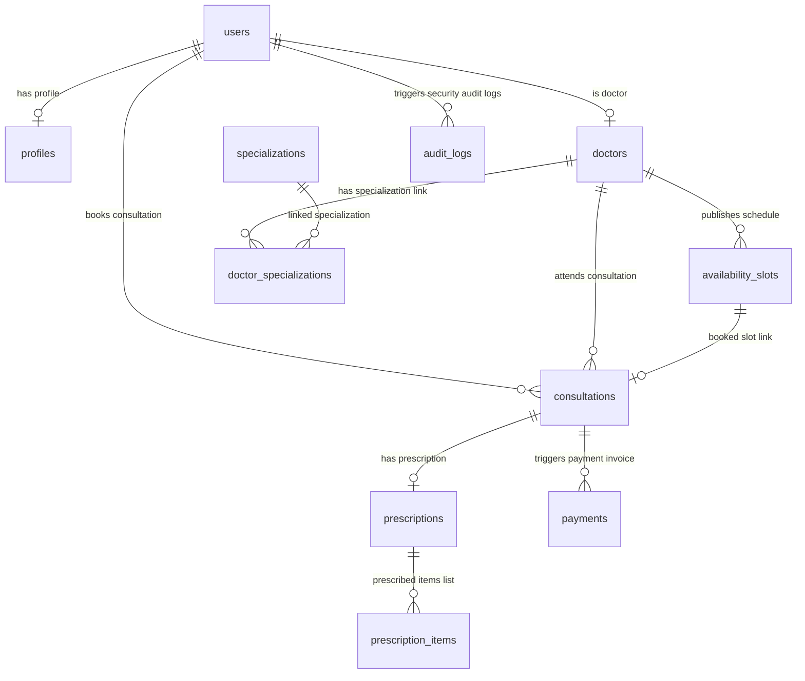

# CareSync Telemedicine Portal: System Architecture & Threat Model

This document outlines the high-level architecture, performance strategies, database design, and security threat modeling implemented in CareSync to support an expected scale of **100k daily consultations** with sub-millisecond latencies.

---

## 1. High-Level System Architecture

CareSync uses a modular architecture built for containerized deployment, ensuring horizontal scaling and high availability.

```
                      +-----------------------------+
                      |   Client Web Browser        |
                      |  (React 19 + Tailwind v4)   |
                      +--------------+--------------+
                                     |
                                     |  HTTP REST / Cookie Sessions
                                     v
                      +--------------+--------------+
                      |   Nginx Ingress / Proxy     |
                      +--------------+--------------+
                                     |
                                     v
                      +--------------+--------------+
                      |  Express.js API Layer       |
                      |    (Modular Services)       |
                      +-------+--------------+------+
                              |              |
                              |              |
           Read caching       v              v  Write-through / transactions
         +--------------------+----+    +----+-------------------+
         | Redis Cache Layer       |    | PostgreSQL DB Engine   |
         | (Slots / Listings / Rx) |    | (100k Consults/Day)    |
         +-------------------------+    +------------------------+
```

### Flow Components:
1. **Frontend App**: SPA served via Nginx. Performs client-side routing on URL pathname changes.
2. **Express Backend**: Hosts authenticated route groups. Connects to PostgreSQL using Sequelize ORM.
3. **Database Layer**: High availability configuration. Master handles all locking write transactions, replicas handle read operations.
4. **Cache Layer**: Redis caching is placed in front of heavy read endpoints (like Doctor Search and Availability Listings).

---

## 2. Booking Flow Concurrency Sequence

Preventing slot double-booking at scale requires deterministic transaction locks. CareSync enforces row-level locking (`SELECT FOR UPDATE`) to guarantee transaction isolation.

```
Patient 1 Session                   Database Engine (Master)                  Patient 2 Session
       |                                       |                                       |
       |----- POST /consultations (slot 9) ---->|                                       |
       |      [Transaction Open]               |                                       |
       |      SELECT slot 9 FOR UPDATE         |                                       |
       |      (Obtains Row-Level Lock)         |                                       |
       |                                       |----- POST /consultations (slot 9) ---->|
       |                                       |      [Transaction Open]               |
       |                                       |      SELECT slot 9 FOR UPDATE         |
       |                                       |      (Blocked - Awaiting Lock)        |
       |                                       |                 .                     |
       |----- UPDATE slot 9 status = 'BOOKED' ->|                 .                     |
       |----- INSERT Consultation record ----->|                 .                     |
       |----- COMMIT Transaction ------------->|                 .                     |
       |      (Releases Row-Level Lock)        |                 .                     |
       |                                       |                                       |
       |<==== returns 201 Created (Success) ===|                                       |
       |                                       |                                       |
       |                                       |---- (Obtains Row-Level Lock) -------->|
       |                                       |      Reads status = 'BOOKED'          |
       |                                       |      [Aborts - ROLLBACK]              |
       |                                       |                                       |
       |                                       |<==== returns 409 Conflict (Failed) ===|
```

---

## 3. Database Indexing & Performance Strategy

To meet the requirement of **p95 < 200ms for read queries** at scale, PostgreSQL indexing is optimized for the heaviest application query patterns:

1. **Practitioner Search & Directory Listings**:
   * Multi-column index on `profiles (last_name, first_name)` is applied to make searches by practitioner name extremely fast.
2. **Active Calendar Slots Retrieves**:
   * Composite index on `availability_slots (doctor_id, start_time, status)` optimizes retrievals of a practitioner's active calendar.
   * B-Tree index on `availability_slots (start_time, end_time)` speeds up date range filtering.
3. **Historical / Dashboard Audits**:
   * Indexes on `consultations (patient_id, status)` and `consultations (doctor_id, status)` ensure dashboard listings load immediately.
   * Index on `audit_logs (resource_type, resource_id)` allows admins to track mutations in sub-milliseconds.

---

## 4. Caching & Scaling Strategy (Redis)

To handle 100k daily consultations, read queries are offloaded to an in-memory **Redis Cache**:

1. **Doctor Profiles & Specializations**:
   * Cached for 1 hour. Invalidation occurs if an admin updates doctor verification details.
2. **Availability Calendar Slots**:
   * Cached with a TTL of 5 minutes.
   * When a patient books an appointment, the cache is instantly invalidated to ensure real-time accuracy.
3. **Cache-Aside Pattern**:
   * The app reads from the cache first. If a cache miss occurs, the server queries PostgreSQL, updates Redis, and returns the response.

---

## 5. Security & Threat Modeling (OWASP Mitigations)

Healthcare platforms require strict compliance guidelines (HIPAA/GDPR). CareSync integrates the following security policies:

### Access & Session Controls
* **MFA & RBAC**: Roles (`PATIENT`, `DOCTOR`, `ADMIN`) are checked at the gateway level.
* **HttpOnly Session Cookies**: Session JWTs are signed with a 256-bit secret and delivered inside `HttpOnly, Secure, SameSite=Lax` cookies, preventing XSS-based session hijacking.

### Input Sanitization & Attack Mitigations
* **SQL Injection Prevention**: Sequelize ORM parameterizes all SQL queries natively.
* **XSS Mitigation**: Input fields are sanitized. Express headers restrict iframe embedding (`X-Frame-Options: DENY`) and MIME type sniffing.
* **Rate Limiting**: Integrated at the Express router level to restrict DDoS attempts and brute-force auth requests.

### Protected Health Information (PHI) Encryption
* **Data Classification**: Database columns containing PHI (such as patient addresses, diagnoses notes, and prescriptions) are classified.
* **Encryption-at-Rest**: Handled at the database tablespace level.
* **Prescription Integrity & Non-Repudiation**: Issued prescriptions calculate an `HMAC-SHA256` signature binding the doctor, patient, and drug lists together using a key rotated annually. If a prescription record is modified at the database layer, the signature becomes invalid, preventing tamper fraud.

### Audit Trails
* All write operations generate immutable, append-only logs in the `audit_logs` table containing the action type, modified resource ID, and the IP/User-Agent of the author.

---

## 6. Entity Relationship (ER) Diagram



---

## 7. Data Partitioning Strategy

To support **100k daily consultations** and prevent tables from expanding beyond standard index sizes, we apply data partitioning:

1. **`audit_logs` Partitioning**:
   * Divided by **Range Partitioning** using the `created_at` timestamp.
   * A new partition is dynamically allocated every calendar month.
   * Replicated partitions older than 1 year are offloaded to cold storage (e.g., S3 Glacier) to keep indices small.
2. **`consultations` & `payments` Partitioning**:
   * Divided by **List Partitioning** using the `status` column or range partitioning by year.
   * This isolates active, pending workflows from completed history records, keeping memory tables compact.

---

## 8. Transaction Management & Sagas

When a patient books an appointment, multiple database operations (locking slot, creating consultation, establishing payments, logging audits) must succeed or fail together.

1. **Database Transactions (ACID)**:
   * Carried out inside a single Postgres transaction context.
   * If any step fails (e.g. creating the payment record fails), the transaction rolls back, releasing row-level locks on the availability slot.
2. **Saga Pattern (Choreography)**:
   * For integrations with external services (like Stripe checkouts or notification gateways), we use a Choreography Saga:
     * Step 1: Appointment is booked (consultation status is `SCHEDULED`, payment status is `PENDING`).
     * Step 2: Payment checkout succeeds $\rightarrow$ updates payment to `SUCCESS` and publishes notification message.
     * Step 3: If payment fails or timeout expires (15 minutes) $\rightarrow$ compensation logic reverts slot status back to `AVAILABLE` and marks consultation as `CANCELLED`.

---

## 9. Retry & Backoff Strategy

In case of concurrency conflicts or database lock timeout exceptions:

1. **Exponential Backoff**:
   * API clients retry failed requests using exponential backoff:
     \[t_{retry} = t_{base} \times 2^{attempt} + \text{jitter}\]
   * Jitter introduces random offsets to prevent thundering herd problems on PostgreSQL.
2. **Circuit Breakers**:
   * Placed in front of external dependencies (e.g., Stripe, email verification providers).
   * Prevents cascading thread resource blockages when external systems go offline.

---

## 10. Backup & Disaster Recovery (DR) Strategy

To meet **99.95% availability** requirements:

1. **Continuous Backup (Point-in-Time Recovery)**:
   * Write-Ahead Logging (WAL) files are continuously archived to secure cloud storage (AWS S3) using utilities like pgBackRest.
   * Allows recovery of the database to any millisecond within the retention period (typically 30 days).
2. **Disaster Recovery (Active-Passive)**:
   * CareSync deploys an active-passive configuration across multiple regions.
   * Streaming replication keeps the passive stand-by database sync synchronized with the master node.
   * If the master node goes offline, DNS failover redirects traffic to the standby replica within 60 seconds (RTO < 1 min, RPO < 5 seconds).

